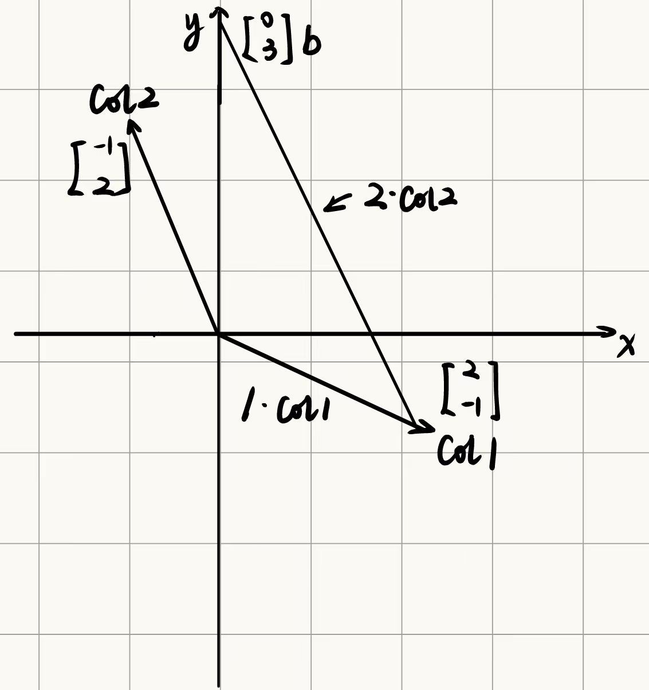

# Chapter 1 Solving Linear Equations $Ax = b$
## 线性方程组的几何表示
举例：
对线性方程组$\begin{cases} 2x-y=0\\-x+2y=3\end{cases}$，用系数矩阵就可以表示为$\begin{bmatrix} 2&-1 \\ -1&2 \end{bmatrix}\begin{bmatrix} x\\y \end{bmatrix} = \begin{bmatrix} 0\\3 \end{bmatrix}$，也就是$Ax=b$**(dot product)**的形式
行图像(Row Picture)表示如下：

上面的线性方程组也可以表示成线性组合(Linear Conbination)的形式：
$$
x\begin{bmatrix}2\\-1 \end{bmatrix} + y\begin{bmatrix} -1\\2 \end{bmatrix} = \begin{bmatrix} 0\\3 \end{bmatrix}
$$
列图像(Column Picture)表示如下：(求解可得$x=1,y=2$)

同理，对于下面的三元方程组：$\begin{cases} 2x-y=0 \\ -x+2y-z=-1 \\ -3y+4z=4 \end{cases}$，$A=\begin{bmatrix} 2&-1&0 \\ -1&2&-1 \\ 0&-3&4 \end{bmatrix},b=\begin{bmatrix} 0\\-1\\4\end{bmatrix}$
线性组合的形式为：
$$
x\begin{bmatrix} 2\\-1\\0 \end{bmatrix} + y\begin{bmatrix} -1\\2\\4 \end{bmatrix} +z\begin{bmatrix} 0\\-1\\4 \end{bmatrix} = \begin{bmatrix} 0\\-1\\4 \end{bmatrix}
$$
!!! Question "思考"

​	1. 对任意的$b$，是否都能求解$Ax=b$ ？

​	2. 这些列的线性组合能否覆盖整个线性空间？

**定义：**若矩阵所有列向量的线性组合可以覆盖整个线性空间，则称该矩阵的列向量线性无关；若存在某一列向量可以用其他列向量线性表示，则称该矩阵的列向量线性相关

**若$A$矩阵的列向量线性无关，则$Ax=0$当且仅当$x$是零向量**

因此$Ax=b$可以用线性组合的方法进行计算，例如 
$$
\begin{bmatrix} 2&5 \\ 1&3 \end{bmatrix} \begin{bmatrix} 1 \\ 2 \end{bmatrix} = 1\begin{bmatrix} 2 \\ 1 \end{bmatrix} + 2\begin{bmatrix} 5 \\ 3 \end{bmatrix} = \begin{bmatrix} 12\\7 \end{bmatrix}
$$
**$Ax$的本质就是列向量的线性组合**，所有列向量的线性组合称为列空间

课程资源：

[官方给出的课堂笔记](https://ocw.mit.edu/courses/18-06sc-linear-algebra-fall-2011/resources/mit18_06scf11_ses1-1sum/)

[课堂作业](https://ocw.mit.edu/courses/18-06sc-linear-algebra-fall-2011/resources/mit18_06scf11_ses1-1prob/)

[作业答案](https://ocw.mit.edu/courses/18-06sc-linear-algebra-fall-2011/resources/mit18_06scf11_ses1-1sol/)

[习题讲解](https://ocw.mit.edu/courses/18-06sc-linear-algebra-fall-2011/resources/geometry-of-linear-algebra/)

## 矩阵消元

### 高斯消元法求解线性方程组

求解线性方程组$\begin{cases} x+2y+z=2 \\ 3x+8y+z=12 \\4y+z=2 \end{cases}$，将此方程组表示成$Ax=b$的形式，则$ A=\begin{bmatrix} 1&2&1 \\ 3&8&1 \\ 0&4&1 \end{bmatrix}$，那么如何通过消元法来求解线性方程组呢？

!!! Note "技巧"

​	消元时一般将系数为1的优先当作主元，且主元不能为0

**Step1：消元(Elimination)**
$$
A \overset{R_2-3R_1}{\longrightarrow} \begin{bmatrix} 1&2&1 \\ 0&2&-2 \\0&4&1 \end{bmatrix} \overset{R_3-2R_2}{\longrightarrow} \begin{bmatrix} 1&2&1 \\ 0&2&-2 \\ 0&0&5 \end{bmatrix}(U)
$$
!!! Warning "消元失效的情况"

​	如果经过消元无法得到三个主元，也就是某个主元为0，可以尝试通过行	变换使得对角线上的主元为非零元素，如果最后一行再也没有非0元素，则此方程组无解或有多个解

**Step 2：回代(Back Substitution)**

将$b$带入到上述消元过程，则有
$$
\begin{bmatrix} A&b \end{bmatrix} \overset{R_2-3R_1}{\longrightarrow} \begin{bmatrix} 1&2&1&2 \\ 0&2&-2&6 \\0&4&1&2 \end{bmatrix} \overset{R_3-2R_2}{\longrightarrow} \begin{bmatrix} 1&2&1&2 \\ 0&2&-2&6 \\ 0&0&5&-10 \end{bmatrix}(U)
$$
最终得到的结果为$\begin{cases} x+2y+z=2 \\ 2y-2z=6 \\5z=-10 \end{cases}(Ux=c)$，解得$\begin{cases} x=2 \\y=1\\z=-2\end{cases}$

### 消元矩阵

**矩阵乘法：左行右列**

**左乘可以表示成行向量的线性组合，右乘可以表示成列向量的线性组合**

例如：
$$
\begin{bmatrix} -&-&- \\ -&-&- \\-&-&- \end{bmatrix}\begin{bmatrix} 3\\4\\5 \end{bmatrix} = 3\times col1 + 4\times col2 +5\times col3
$$

$$
\begin{bmatrix} 1&2&7 \end{bmatrix} \begin{bmatrix} -&-&- \\ -&-&- \\-&-&- \end{bmatrix} = 1\times row1 + 2\times row2 + 7\times row3
$$

现在要用矩阵乘法的形式表示上面的线性方程组系数矩阵的消元过程：

**Step 1: $R_2-3R_1$**
$$
\begin{bmatrix} 1&0&0 \\ -3&1&0 \\ 0&0&1 \end{bmatrix} \begin{bmatrix} 1&2&1 \\ 3&8&1 \\ 0&4&1 \end{bmatrix} = \begin{bmatrix} 1&2&1 \\ 0&2&-2 \\0&4&1 \end{bmatrix}
$$
这样我们就得到了左侧的消元矩阵，记为$E_{21}$（表示行2和行1进行了变换），我们还需要进行检验，例如要检验行2列3的元素，需要计算$\begin{bmatrix} -3&1&0 \end{bmatrix} \begin{bmatrix} 1\\1\\1 \end{bmatrix} = -2$，结果正确

**Step 2: $R_3-2R_2$**
$$
\begin{bmatrix} 1&0&0 \\ 0&1&0 \\ 0&-2&1 \end{bmatrix}\begin{bmatrix} 1&2&1 \\ 0&2&-2 \\0&4&1 \end{bmatrix} = \begin{bmatrix} 1&2&1 \\ 0&2&-2 \\ 0&0&5 \end{bmatrix}
$$
这里得到了第二个消元矩阵，记为$E_{32}$

整个消元过程就是$E_{32}(E_{21}A) = U \rarr (E_{32}E_{21})A = U$（矩阵乘法的结合律）

!!! Warning "注意"

​	矩阵乘法没有交换律，即$AB \ne BA$

课程资源：

[官方给出的课堂笔记](https://ocw.mit.edu/courses/18-06sc-linear-algebra-fall-2011/resources/mit18_06scf11_ses1-2sum/)

[课堂作业](https://ocw.mit.edu/courses/18-06sc-linear-algebra-fall-2011/resources/mit18_06scf11_ses1-2prob/)

[作业答案](https://ocw.mit.edu/courses/18-06sc-linear-algebra-fall-2011/resources/mit18_06scf11_ses1-2sol/)

[习题讲解](https://ocw.mit.edu/courses/18-06sc-linear-algebra-fall-2011/resources/recitation-elimination-with-matrices/)

## 矩阵乘法和逆

### 矩阵乘法

**方法一(公式法)**：设$A$是一个$m\times n$矩阵，$B$是一个$n\times p$矩阵，则$C=AB$是一个$m\times p$矩阵，且有
$$
c_{ij} = \sum_{k=1}^n{a_{ik}b_{kj}}
$$
**方法二：**

- 将矩阵乘法看作$A$和$B$中的$p$个列向量相乘，则$C$中的每一列都是$A$中各列的线性组合，$B$中的列向量就是线性组合的系数
- 将矩阵乘法看作$A$的$m$个行向量和$B$相乘，则$C$中的每一行都是$B$中各行的线性组合，$A$中的行向量就是线性组合的系数

即：设有矩阵$A,B$，如果$B = \begin{bmatrix} b_1&b_2&...&b_p \end{bmatrix}$，则$AB = \begin{bmatrix} Ab_1&Ab_2&...&Ab_p \end{bmatrix}$，如果$A = \begin{bmatrix} a_1\\a_2\\...\\a_m \end{bmatrix}$，则$AB = \begin{bmatrix} a_1B \\ a_2B \\ ... \\ a_pB \end{bmatrix}$

**方法三：**$A$的列$(m\times 1)$乘$B$的行$(1\times p)$，即
$$
AB = \sum A的列 \times B的行
$$
举个:chestnut:：
$$
\begin{bmatrix} 2&7 \\3&8 \\4&9 \end{bmatrix} \begin{bmatrix} 1&6 \\ 0&0 \end{bmatrix} = \begin{bmatrix} 2\\3\\4 \end{bmatrix} \begin{bmatrix}1&6\end{bmatrix}+\begin{bmatrix}7\\8\\9\end{bmatrix}\begin{bmatrix}0&0\end{bmatrix}
$$
**方法四：矩阵分块**
$$
\underset{A}{\begin{bmatrix} A_1&A_2 \\A_3&A_4\end{bmatrix}} + \underset{B}{\begin{bmatrix} B_1&B_2 \\B_3&B_4\end{bmatrix}} = \underset{C}{\begin{bmatrix} A_1B_1+A_2B_3&A_1B_2+A_2B_4 \\A_3B_1+A_4B_3&A_3B_2+A_4B_4\end{bmatrix}}
$$
!!! Tip "提示"

​	分块时对应的各个分块要互相匹配(A的列数=B的行数)

### 矩阵的逆

**重要性质：**$AA^{-1} = A^{-1}A = I(单位矩阵)$，**前提是矩阵的逆存在**

**定义：**如果一个矩阵的逆存在，则称该矩阵是可逆的，也称非奇异的；如果一个矩阵的逆不存在，则称该矩阵是不可逆的，也称奇异矩阵

**矩阵的逆不存在的条件：**

- 举例：$A=\begin{bmatrix} 1&3 \\2&6\end{bmatrix}$是一个不可逆矩阵，因为$A$乘任何矩阵得到的结果对应的列向量都是$A$中列向量的线性组合，而由于$A$中的列向量共线，且$\begin{bmatrix} 1\\0\end{bmatrix}$不在这条直线上，因此不可逆

- **定理1：**对于$n\times n$矩阵，矩阵的逆存在当且仅当消元后有$n$个主元

- **定理2：**如果矩阵的逆存在，则逆矩阵唯一

  **Proof：**设$BA=I$且$AC=I$，下面证明$B=C$

  $B(AC) = (BA)C \Rightarrow BI=IC 或B=C$

- **定理3：**如果$A$是可逆的，则线性方程组$Ax=b$有且仅有唯一解，其解为$x=A^{-1}b$

- **定理4：**若存在非零向量$x$使得$Ax=0$，则$A$的列向量线性相关，$A$不可逆(反证法：如果$A$可逆，则方程两边同时乘以$A^{-1}$，则有$x=A^{-1}0 = 0$，矛盾)

- **定理5：**一个方阵可逆当且仅当列向量线性无关

- **定理6：**$A矩阵可逆\Leftrightarrow |A| \ne0$

**求逆矩阵(Gauss-Jordan)**

例子：
$$
\underset{A}{\begin{bmatrix}1&3 \\2&7\end{bmatrix}}\underset{A^{-1}}{\begin{bmatrix} a&c \\ b&d\end{bmatrix}} = \underset{I}{\begin{bmatrix} 1&0\\0&1 \end{bmatrix}} \Rightarrow \begin{cases}{\begin{bmatrix}1&3 \\2&7\end{bmatrix}\begin{bmatrix}a\\b\end{bmatrix} = \begin{bmatrix} 1\\0 \end{bmatrix}} \\ {\begin{bmatrix}1&3 \\2&7\end{bmatrix}\begin{bmatrix}c\\d\end{bmatrix} = \begin{bmatrix} 0\\1 \end{bmatrix}}\end{cases}
$$
怎么同时求两个方程组呢？用增广矩阵！
$$
\left[
\begin{array}{cc:cc}
1 & 3 & 1 & 0 \\
2 & 7 & 0 & 1 \\
\end{array}
\right] \rightarrow
\left[
\begin{array}{cc:cc}
1 & 3 & 1 & 0 \\
0 & 1 & -2 & 1 \\
\end{array}
\right] \rightarrow \left[
\begin{array}{cc:cc}
1 & 0 & 7 & -3 \\
0 & 1 & -2 & 1 \\
\end{array}
\right]
$$
**方法：**将$A$矩阵和$I$矩阵表示成$\left[ \begin{array}{c:c} A&I \end{array} \right]$的形式，通过Gauss-Jordan消元法转换成$\left[ \begin{array}{c:c} I&A^{-1} \end{array} \right]$，即可求得$A^{-1}$

## A的LU分解

### 矩阵的逆的性质

$$ (1) AB的逆为B^{-1}A^{-1}$$

$$(2) (A^T)^{-1} = (A^{-1})^T\quad 提示：AA^{-1} = I,对两边矩阵转置得(A^{-1})^TA^T = I$$

### A=LU

举个:chestnut::
$$
\overset{E_{21}}{\begin{bmatrix} 1&0 \\ -4&1\end{bmatrix}}\overset{A}{\begin{bmatrix} 2&1 \\ 8&7 \end{bmatrix}} = \overset{U}{\begin{bmatrix} 2&1 \\ 0&3 \end{bmatrix}}(行变换)
$$
表示成$A = LU$的形式就是：
$$
\overset{A}{\begin{bmatrix} 2&1 \\ 8&7 \end{bmatrix}} = \overset{L}{\begin{bmatrix} 1&0 \\ 4&1\end{bmatrix}}\overset{U}{\begin{bmatrix} 2&1 \\ 0&3 \end{bmatrix}}
$$
!!! Question "怎么求矩阵$L$($E_{21}$的逆)"

​	可以把$A=LU$理解为消元过程的逆变换，以上面的$2\times 2$矩阵变换为例，消元时用的是$R_2-4R_1$，那么求$L$的时候就相当于对矩阵$U$进行逆变换使其变成$A$，也就是$R_2 + 4R_1$，即可快速求得矩阵$L$

进一步分解可以得到$A=LDU$:
$$
\overset{A}{\begin{bmatrix} 2&1 \\ 8&7 \end{bmatrix}} = \overset{L}{\begin{bmatrix} 1&0 \\ 4&1\end{bmatrix}}\overset{U}{\begin{bmatrix} 2&1 \\ 0&3 \end{bmatrix}} = \overset{L}{\begin{bmatrix} 1&0 \\ 4&1\end{bmatrix}} \overset{D}{\begin{bmatrix} 2&0 \\ 0&3 \end{bmatrix}} \overset{U}{\begin{bmatrix} 1&1/2 \\ 0&1 \end{bmatrix}}
$$
!!! Tip ""

​	$A = LU$中的$L$指的是下三角矩阵(Lower Triangle)，$U$指的是上三角矩阵(Upper Triangle)，$D$指的是对角阵(diagonal)

下面讨论一般情况：假设矩阵$A$经过一系列变换得到矩阵$U$，比如$E_{32}E_{31}E_{21}A = U(没有行互换)$，表示成$A = LU$的形式为$A = E_{21}^{-1}E_{31}^{-1}E_{21}^{-1}U = LU$

话说为什么要表示成$A=LU$的形式呢，直接用$A$矩阵左乘消元矩阵表示它不香吗？这是有原因的。假设对于一个$3 \times 3$矩阵，如果依次左乘消元矩阵$E_{21},E_{32}$，在这个过程中就是先让第二行与第一行进行行变换，第三行再与新的第二行进行行变换，最后的结果无法明显展示出变换过程，你也就不能快速的写出矩阵$E$，就比如下面的例子：
$$
E_{21} = \begin{bmatrix} 1&0&0 \\ -2&1&0 \\ 0&0&1 \end{bmatrix},E_{32} = \begin{bmatrix} 1&0&0 \\ 0&1&0 \\ 0&-5&1 \end{bmatrix},则E_{32}E_{21} = \begin{bmatrix} 1&0&0 \\ -2&1&0 \\10&-5&1 \end{bmatrix} = E
$$
从最后得到的矩阵可以看出，相当于将原矩阵做了$R_2-2R_1$和$R_3-5R_2+10R_1$两个行变换，不能一目了然地看出对原矩阵是如何进行行变换的，改成$A=LU$的形式就很明显了：
$$
E_{21}^{-1} = \begin{bmatrix} 1&0&0 \\ 2&1&0 \\ 0&0&1 \end{bmatrix},E_{32}^{-1} = \begin{bmatrix} 1&0&0 \\ 0&1&0 \\ 0&5&1 \end{bmatrix},则E_{32}^{-1}E_{21}^{-1} = \begin{bmatrix} 1&0&0 \\ 2&1&0 \\0&5&1 \end{bmatrix} = L
$$
最后的矩阵表示的是逆变换的过程，明显的可以看出原矩阵是怎么做行变换的，更重要的是你可以快速的写出$L$矩阵，只需要把行变换的乘数放进去就可以了

也就是说：**:mega:如果没有行互换，只需要将消元乘数填写到对应位置就可以得到$L$矩阵**

**提问：将$n\times n$的矩阵$A$变换为矩阵$U$需要多少次操作？（注：矩阵$A$中的元素均非零，且为非奇异矩阵， 矩阵中一个元素的乘法和减法算一次操作）**

**ANS：$O(N^3)$**

## 转置与置换

### 置换矩阵

定义：**置换矩阵(Permutations)**，记作$P$，是用来对矩阵进行行互换和列互换的矩阵

例如：交换某一矩阵的第一行和第二行
$$
\begin{bmatrix}0&1 \\ 1&0 \end{bmatrix}\begin{bmatrix} a&b \\ c&d \end{bmatrix} = \begin{bmatrix} c&d \\a&b \end{bmatrix}
$$
交换某一矩阵的第一列和第二列
$$
\begin{bmatrix} a&b \\ c&d \end{bmatrix}\begin{bmatrix}0&1 \\ 1&0 \end{bmatrix} = \begin{bmatrix} b&a \\d&c \end{bmatrix}
$$
**注：置换矩阵是行重新排列的单位矩阵，如果对某一矩阵进行行互换，只需要左乘对应的置换矩阵即可，如果是列互换，只需要又称对应的矩阵即可**

例如：如果$P = \begin{bmatrix} 1&0&0 \\ 0&0&1 \\ 0&1&0 \end{bmatrix}$，则$PA$就是将矩阵$A$的第二行和第三行进行互换，$AP$就是将矩阵$A$的第二列和第三列进行互换

!!! Tip ""

​	对于$n\times n$的矩阵，共有$n!$个置换矩阵

性质：

$(1)P^{-1} = P^T$

$(2)PP^T = I$

证明：考虑$PP^T$的第$(i,j)$个元素，则有
$$
(PP^T)_{i,j} =\sum^n_{k=1}P_{i,k}P^T_{k,j} = \sum^n_{k=1}P_{i,k}P_{j,k}
$$
由于$P$是置换矩阵，因此每一行只有一个元素为1，其余为0：

- 当$i \ne j$时，由于每一列也只有一个1，所以$P_{i,k}$和$P_{j,k}$不会同时为1，故$(PP^T)_{i,j}= 0$

- 当$i = j$时，则$P_{i,k}P_{i,k}$只有在$P_{i,k} = 1$时为1，其余为0，因此$(PP^T)_{i,i} = 1$

因此$PP^T = I$

上一节提到了在没有行互换的情况下矩阵$A$可以分解成$A = LU$的形式，那么如果有行互换呢？

**对于任何可逆矩阵$A$，其分解可以表示为$PA = LU$**

### 矩阵转置

定义：对于一个$m\times n$矩阵$A$，它的转置$A^T$是一个$n\times m$矩阵，其中$(A^T)_{i,j} = A_{j,i}$

性质：$(AB)^T = B^TA^T$

**我们称具有$A = A^T$性质的矩阵为对称矩阵，例如$A = \begin{bmatrix} 3&7&1 \\ 7&2&4 \\ 1&4&6\end{bmatrix}$，对任意矩阵$A$，$AA^T$是一个对称矩阵**

## 向量空间

